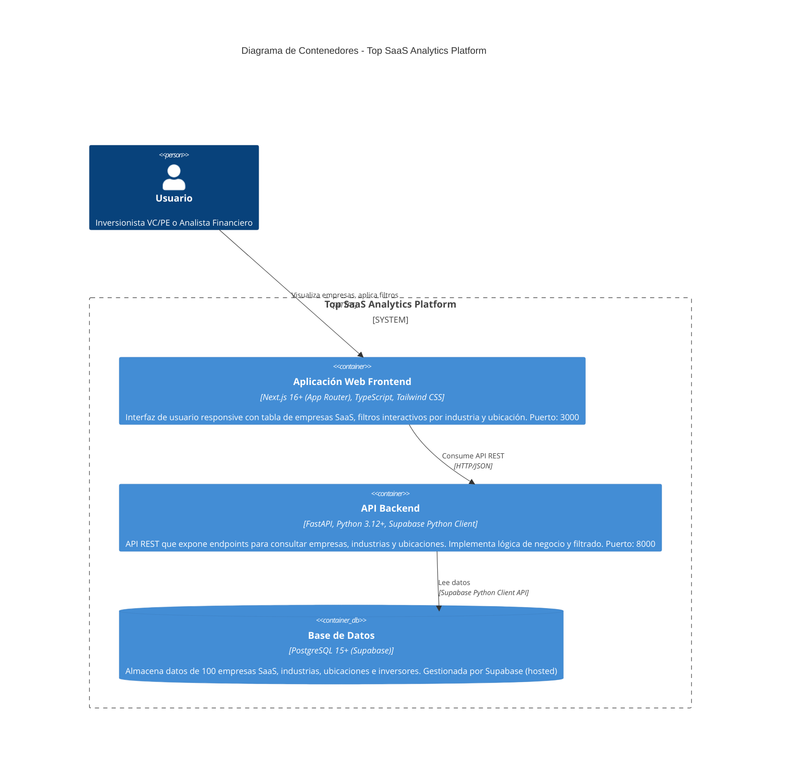

# Diagrama de Contenedores C4 - Top SaaS Analytics Platform

**Nivel 2 del Modelo C4**: Descomposición del sistema en contenedores y sus interacciones.

---

## Descripción

Este diagrama muestra los principales contenedores (aplicaciones/servicios) que componen el sistema Top SaaS Analytics Platform, sus tecnologías, responsabilidades y cómo se comunican entre sí.

---

## Diagrama



---

## Contenedores

### 1. Frontend - Aplicación Web
**Tecnología**: Next.js 16+ (App Router) + TypeScript + Tailwind CSS  
**Puerto**: 3000  
**Tipo**: Single Page Application (SPA) con Server Components

**Responsabilidades**:
- Renderizar interfaz de usuario responsive
- Mostrar tabla de empresas SaaS con todas sus métricas
- Proveer filtros interactivos (dropdowns de industria y ubicación)
- Formatear datos financieros (montos, porcentajes)
- Manejar estados de carga y errores
- Indicador de conexión con backend (BackendStatus)

**Estructura interna**:
- **Pages/Components**: Componentes React (CompanyTable, CompanyFilters, BackendStatus)
- **Hooks**: Custom hooks para data fetching (useCompanies, useIndustries, useLocations)
- **Services**: Cliente API para comunicación con backend
- **Types**: Definiciones TypeScript de contratos de datos

**Dependencias clave**:
- React 18+
- Next.js 16+ (App Router)
- TypeScript
- Tailwind CSS

---

### 2. Backend API - Servicio REST
**Tecnología**: FastAPI + Python 3.12+ + Supabase Python Client  
**Puerto**: 8000  
**Tipo**: API REST asíncrona

**Responsabilidades**:
- Exponer endpoints REST para consulta de datos:
  - `GET /api/v1/companies?industry_id=X&location_id=Y` - Listar empresas con filtros opcionales
  - `GET /api/v1/industries` - Listar todas las industrias
  - `GET /api/v1/locations` - Listar todas las ubicaciones
  - `GET /api/v1/health` - Health check del servicio
- Implementar lógica de negocio y validación de datos
- Transformar datos de DB a schemas Pydantic (response models)
- Aplicar filtros server-side en queries SQL
- Manejar CORS para permitir requests desde frontend
- Logging de requests y errores

**Arquitectura por capas**:
- **Routers** (`api/`): Definición de endpoints, validación de requests
- **Services** (`services/`): Lógica de negocio, transformación de datos
- **Repositories** (`repositories/`): Acceso a datos vía Supabase Client
- **Schemas** (`schemas/`): Modelos Pydantic para request/response
- **Core** (`core/`): Configuración, database client, logging

**Autenticación**:
- Backend usa **service role key** de Supabase para acceso completo a DB
- Sin autenticación de usuarios finales en MVP

**Dependencias clave**:
- FastAPI
- Uvicorn (ASGI server)
- Pydantic (validación)
- Supabase Python Client
- python-dotenv

---

### 3. Base de Datos - PostgreSQL (Supabase)
**Tecnología**: PostgreSQL 15+ (hosted en Supabase)  
**Tipo**: Base de datos relacional

**Responsabilidades**:
- Almacenar datos de 100 empresas SaaS con sus métricas
- Gestionar catálogos de industrias y ubicaciones
- Almacenar información de inversores y sus relaciones con empresas
- Proveer índices para queries optimizadas

**Esquema de datos**:
- **company**: Empresas SaaS (id, name, products, founding_year, total_funding, arr, valuation, employees, g2_rating, industry_id, location_id)
- **industry**: Industrias/sectores (id, name)
- **location**: Ubicaciones geográficas (id, city, state, country)
- **investor**: Inversores (id, name)
- **company_investor**: Tabla de unión M:N entre empresas e inversores

**Índices**:
- `idx_company_industry` - Optimiza filtrado por industria
- `idx_company_location` - Optimiza filtrado por ubicación
- Claves primarias y foráneas con índices automáticos

**Gestión**:
- Hosted y gestionado por Supabase
- Backups automáticos
- Acceso vía Supabase API desde backend

---

## Interacciones entre Contenedores

### Frontend → Backend
**Protocolo**: HTTP/REST  
**Formato**: JSON  
**Endpoints principales**:
```
GET /api/v1/companies?industry_id=5&location_id=12
GET /api/v1/industries
GET /api/v1/locations
GET /api/v1/health
```

**Flujo típico**:
1. Usuario selecciona filtro en UI
2. Frontend construye URL con query parameters
3. Frontend ejecuta `fetch(API_URL + endpoint)`
4. Backend procesa request y retorna JSON
5. Frontend actualiza UI con datos recibidos

**Configuración**:
- Base URL: `http://localhost:8000` (desarrollo)
- CORS habilitado: `http://localhost:3000`
- Headers: `Content-Type: application/json`

---

### Backend → Supabase Database
**Método de acceso**: Supabase Python Client  
**Tipo de comunicación**: API calls (abstracción sobre PostgreSQL)

**Operaciones típicas**:
```python
# Query con filtros
client.table('company').select('*, industry(*), location(*)').eq('industry_id', 5).execute()

# Query sin filtros
client.table('industry').select('*').order('name').execute()
```

**Ventajas de Supabase Client**:
- API REST-like simplificada vs SQL directo
- Manejo automático de conexiones
- Integración con features de Supabase (RLS, Auth)
- No requiere ORM ni mapeo de objetos

**Autenticación**:
- Backend usa **service role key** (acceso completo)
- Configurado vía variables de entorno:
  - `SUPABASE_URL`: URL del proyecto Supabase
  - `SUPABASE_KEY`: Service role key

---

## Despliegue y Escalabilidad

### Entorno de Desarrollo
- **Frontend**: `npm run dev` en puerto 3000 con hot reload
- **Backend**: `uv run fastapi dev` en puerto 8000 con auto-reload
- **Database**: Supabase hosted (no requiere instalación local)

### Límites del Sistema
- **Frontend y Backend** dentro del límite del sistema
- **Database** también dentro del límite (aunque hosted, es parte integral)
- **Usuarios** fuera del límite del sistema

### Consideraciones de Escalabilidad
- **Frontend**: Puede escalar horizontalmente (CDN, múltiples instancias)
- **Backend**: Puede escalar horizontalmente (múltiples workers de Uvicorn)
- **Database**: Escalado gestionado por Supabase (vertical/horizontal según plan)

---

## Decisiones Arquitectónicas Relacionadas

Ver ADRs para contexto completo:
- **ADR-001**: Justificación de arquitectura por capas con Supabase
- **ADR-002**: Decisión de filtros server-side vs client-side
- **ADR-003**: Decisión de no implementar paginación en MVP
