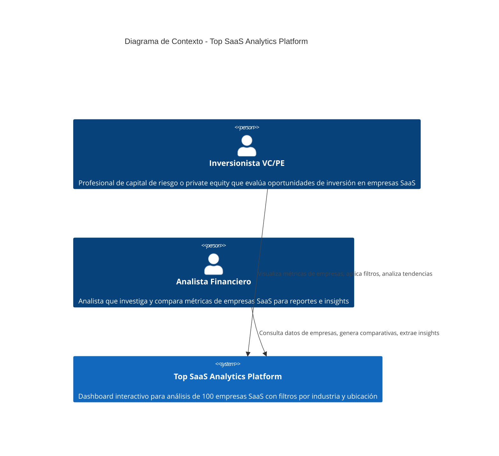

# Diagrama de Contexto C4 - Top SaaS Analytics Platform

**Nivel 1 del Modelo C4**: Vista de alto nivel del sistema y sus usuarios.

---

## Descripción del Sistema

**Top SaaS Analytics Platform** es un dashboard interactivo que permite a inversionistas y analistas financieros visualizar y analizar métricas clave de 100 empresas SaaS líderes, aplicando filtros por industria y ubicación geográfica.

---

## Diagrama

---

## Actores

### Usuario Primario: Inversionista VC/PE
- **Rol**: Toma decisiones de inversión en empresas SaaS
- **Necesidades**:
  - Visualizar métricas financieras (ARR, valoración, funding total)
  - Filtrar empresas por industria específica
  - Identificar empresas por ubicación geográfica
  - Comparar múltiples empresas simultáneamente

### Usuario Secundario: Analista Financiero
- **Rol**: Investigación y análisis de mercado SaaS
- **Necesidades**:
  - Acceso rápido a datos de 100 empresas SaaS
  - Capacidad de filtrado para segmentar análisis
  - Visualización clara de métricas operativas (empleados, G2 rating)
  - Información sobre inversores y productos

---

## Interacciones Principales

1. **Visualización de Empresas**: Usuarios acceden al dashboard para ver listado completo de empresas SaaS con sus métricas
2. **Aplicación de Filtros**: Usuarios filtran por industria (ej: CRM, Analytics) y/o ubicación (ej: San Francisco, USA)
3. **Análisis de Métricas**: Usuarios revisan métricas financieras, operativas y de mercado de empresas filtradas

---

## Alcance del Sistema

**Dentro del alcance:**
- Dashboard web responsive con tabla de empresas
- Filtros interactivos por industria y ubicación
- Visualización de métricas: funding, ARR, valoración, empleados, G2 rating, etc.
- API REST para acceso a datos

**Fuera del alcance (MVP):**
- Autenticación de usuarios
- Exportación de datos (CSV, PDF)
- Gráficos y visualizaciones avanzadas
- Comparativas lado a lado de empresas
- Histórico de métricas
- Alertas o notificaciones
