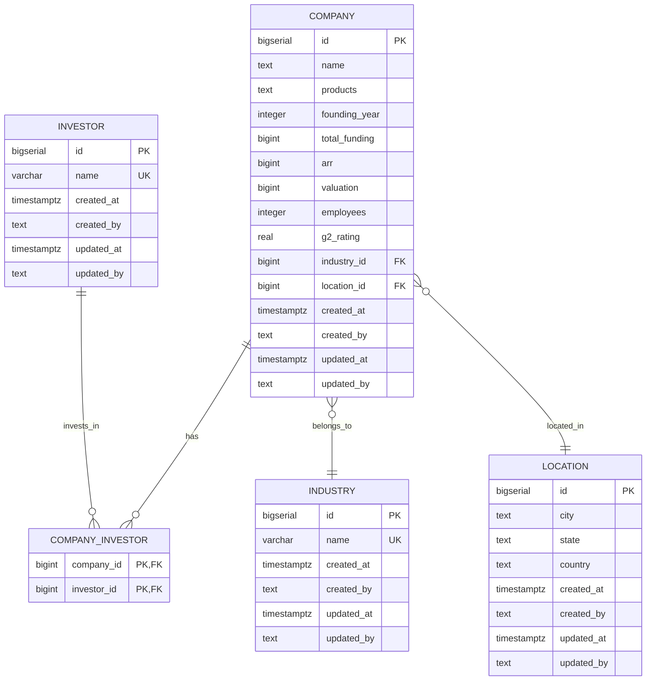

# Diagrama Entidad-Relación - Top SaaS Analytics Platform

**Modelo de Datos**: Base de datos relacional PostgreSQL para almacenamiento de información de empresas SaaS.

---

## Descripción

Este modelo relacional normalizado almacena datos de 100 empresas SaaS con sus métricas operativas y financieras, junto con catálogos de industrias, ubicaciones e inversores.

---

## Diagrama ER



---

## Entidades

### 1. COMPANY (Empresas SaaS)
**Descripción**: Tabla principal que almacena información de las empresas SaaS.

| Campo | Tipo | Restricciones | Descripción |
|-------|------|---------------|-------------|
| id | BIGSERIAL | PRIMARY KEY | Identificador único de la empresa |
| name | TEXT | NOT NULL | Nombre de la empresa |
| products | TEXT | NULL | Descripción de productos/servicios ofrecidos |
| founding_year | INTEGER | NULL | Año de fundación de la empresa |
| total_funding | BIGINT | NULL | Inversión total recibida (en dólares) |
| arr | BIGINT | NULL | Annual Recurring Revenue - Ingresos recurrentes anuales |
| valuation | BIGINT | NULL | Valoración de la empresa (en dólares) |
| employees | INTEGER | NULL | Número de empleados |
| g2_rating | REAL | NULL | Calificación en plataforma G2 (0.0 - 5.0) |
| industry_id | BIGINT | FOREIGN KEY → industry(id) | Industria a la que pertenece |
| location_id | BIGINT | FOREIGN KEY → location(id) | Ubicación de la empresa |
| created_at | TIMESTAMPTZ | NOT NULL, DEFAULT NOW() | Timestamp de creación del registro |
| created_by | TEXT | NULL | Usuario que creó el registro |
| updated_at | TIMESTAMPTZ | NOT NULL, DEFAULT NOW() | Timestamp de última actualización |
| updated_by | TEXT | NULL | Usuario que actualizó el registro |

**Índices**:
- `idx_company_industry` en `industry_id` - Optimiza filtrado por industria
- `idx_company_location` en `location_id` - Optimiza filtrado por ubicación

**Triggers**:
- `update_company_updated_at` - Actualiza automáticamente `updated_at` en cada UPDATE

---

### 2. INDUSTRY (Industrias)
**Descripción**: Catálogo normalizado de industrias/sectores de las empresas SaaS.

| Campo | Tipo | Restricciones | Descripción |
|-------|------|---------------|-------------|
| id | BIGSERIAL | PRIMARY KEY | Identificador único de la industria |
| name | VARCHAR(255) | NOT NULL, UNIQUE | Nombre de la industria |
| created_at | TIMESTAMPTZ | NOT NULL, DEFAULT NOW() | Timestamp de creación |
| created_by | TEXT | NULL | Usuario que creó el registro |
| updated_at | TIMESTAMPTZ | NOT NULL, DEFAULT NOW() | Timestamp de última actualización |
| updated_by | TEXT | NULL | Usuario que actualizó el registro |

**Restricciones**:
- `name` debe ser UNIQUE para evitar duplicados

**Triggers**:
- `update_industry_updated_at` - Actualiza automáticamente `updated_at` en cada UPDATE

**Ejemplos de valores**: CRM, Analytics, Marketing Automation, HR Tech, FinTech, etc.

---

### 3. LOCATION (Ubicaciones)
**Descripción**: Catálogo normalizado de ubicaciones geográficas de las empresas.

| Campo | Tipo | Restricciones | Descripción |
|-------|------|---------------|-------------|
| id | BIGSERIAL | PRIMARY KEY | Identificador único de la ubicación |
| city | TEXT | NOT NULL | Ciudad |
| state | TEXT | NULL | Estado/provincia (opcional) |
| country | TEXT | NOT NULL | País |
| created_at | TIMESTAMPTZ | NOT NULL, DEFAULT NOW() | Timestamp de creación |
| created_by | TEXT | NULL | Usuario que creó el registro |
| updated_at | TIMESTAMPTZ | NOT NULL, DEFAULT NOW() | Timestamp de última actualización |
| updated_by | TEXT | NULL | Usuario que actualizó el registro |

**Triggers**:
- `update_location_updated_at` - Actualiza automáticamente `updated_at` en cada UPDATE

**Ejemplos de valores**: San Francisco/USA, New York/USA, London/UK, Tel Aviv/Israel, etc.

---

### 4. INVESTOR (Inversores)
**Descripción**: Catálogo normalizado de inversores (VC, PE, fondos) que han invertido en las empresas.

| Campo | Tipo | Restricciones | Descripción |
|-------|------|---------------|-------------|
| id | BIGSERIAL | PRIMARY KEY | Identificador único del inversor |
| name | VARCHAR(255) | NOT NULL, UNIQUE | Nombre del inversor/fondo |
| created_at | TIMESTAMPTZ | NOT NULL, DEFAULT NOW() | Timestamp de creación |
| created_by | TEXT | NULL | Usuario que creó el registro |
| updated_at | TIMESTAMPTZ | NOT NULL, DEFAULT NOW() | Timestamp de última actualización |
| updated_by | TEXT | NULL | Usuario que actualizó el registro |

**Restricciones**:
- `name` debe ser UNIQUE para evitar duplicados

**Triggers**:
- `update_investor_updated_at` - Actualiza automáticamente `updated_at` en cada UPDATE

**Ejemplos de valores**: Sequoia Capital, Andreessen Horowitz, Y Combinator, etc.

---

### 5. COMPANY_INVESTOR (Tabla de Unión)
**Descripción**: Tabla de unión para relación muchos a muchos entre empresas e inversores.

| Campo | Tipo | Restricciones | Descripción |
|-------|------|---------------|-------------|
| company_id | BIGINT | PRIMARY KEY, FOREIGN KEY → company(id) | ID de la empresa |
| investor_id | BIGINT | PRIMARY KEY, FOREIGN KEY → investor(id) | ID del inversor |

**Clave Primaria Compuesta**: (company_id, investor_id)

**Comportamiento de eliminación**:
- `ON DELETE CASCADE` - Si se elimina una empresa o inversor, se eliminan automáticamente los registros relacionados

**Índices**:
- `idx_company_investor_company` en `company_id` - Optimiza búsqueda de inversores por empresa
- `idx_company_investor_investor` en `investor_id` - Optimiza búsqueda de empresas por inversor

---

## Relaciones

### 1. COMPANY → INDUSTRY (N:1)
**Cardinalidad**: Muchas empresas pertenecen a una industria  
**Implementación**: `company.industry_id` → `industry.id`  
**Tipo**: Opcional (puede ser NULL si no se conoce la industria)

**Descripción**: Cada empresa está clasificada en una industria específica (CRM, Analytics, etc.). Múltiples empresas pueden pertenecer a la misma industria.

---

### 2. COMPANY → LOCATION (N:1)
**Cardinalidad**: Muchas empresas están ubicadas en una localización  
**Implementación**: `company.location_id` → `location.id`  
**Tipo**: Opcional (puede ser NULL si no se conoce la ubicación)

**Descripción**: Cada empresa tiene una ubicación principal (ciudad/país). Múltiples empresas pueden estar en la misma ubicación.

---

### 3. COMPANY ↔ INVESTOR (M:N)
**Cardinalidad**: Muchas empresas tienen muchos inversores  
**Implementación**: Tabla de unión `company_investor`  
**Tipo**: Opcional (una empresa puede no tener inversores registrados)

**Descripción**: Una empresa puede tener múltiples inversores, y un inversor puede invertir en múltiples empresas. Esta relación se implementa mediante la tabla de unión `company_investor`.

---

## Índices y Optimización

### Índices Creados

| Índice | Tabla | Columna(s) | Propósito |
|--------|-------|------------|-----------|
| `idx_company_industry` | company | industry_id | Optimizar filtrado de empresas por industria |
| `idx_company_location` | company | location_id | Optimizar filtrado de empresas por ubicación |
| `idx_company_investor_company` | company_investor | company_id | Optimizar búsqueda de inversores por empresa |
| `idx_company_investor_investor` | company_investor | investor_id | Optimizar búsqueda de empresas por inversor |

### Índices Implícitos
- **Claves Primarias**: PostgreSQL crea automáticamente índices únicos en todas las PRIMARY KEY
- **Claves Únicas**: Índices únicos en `industry.name` e `investor.name`

### Justificación de Índices
- **Filtros frecuentes**: Los usuarios filtrarán constantemente por industria y ubicación, por lo que estos índices son críticos para performance
- **Joins**: Los índices en claves foráneas optimizan los JOINs necesarios para obtener datos completos de empresas con sus industrias y ubicaciones

---

## Triggers de Auditoría

### Función `update_updated_at_column()`
```sql
CREATE OR REPLACE FUNCTION update_updated_at_column()
RETURNS TRIGGER AS $$
BEGIN
    NEW.updated_at = NOW();
    RETURN NEW;
END;
$$ LANGUAGE plpgsql;
```

### Triggers Aplicados
- `update_company_updated_at` - Tabla `company`
- `update_industry_updated_at` - Tabla `industry`
- `update_location_updated_at` - Tabla `location`
- `update_investor_updated_at` - Tabla `investor`

**Propósito**: Mantener auditoría automática de cambios, actualizando `updated_at` cada vez que se modifica un registro.

---

## Consideraciones de Diseño

### Normalización
- **3NF (Tercera Forma Normal)**: El esquema está normalizado para evitar redundancia
- **Catálogos separados**: Industries, Locations e Investors se mantienen en tablas separadas para facilitar mantenimiento y consistencia

### Campos de Auditoría
Todas las tablas incluyen:
- `created_at` / `created_by`: Rastrear cuándo y quién creó el registro
- `updated_at` / `updated_by`: Rastrear última modificación

### Campos Opcionales en COMPANY
La mayoría de campos métricos son opcionales (NULL permitido) porque:
- No todas las empresas reportan públicamente todas sus métricas
- Permite carga incremental de datos
- Facilita importación de datasets incompletos

### Tipos de Datos
- **BIGINT para montos**: Total funding, ARR y valuation pueden ser valores muy grandes (miles de millones)
- **BIGSERIAL para IDs**: Auto-incremento con rango amplio para escalabilidad
- **TIMESTAMPTZ**: Timestamps con zona horaria para consistency global

---

## Queries Típicas Optimizadas

### 1. Listar empresas con filtros
```sql
-- Sin filtros
SELECT c.*, i.name as industry_name, l.city, l.country
FROM company c
LEFT JOIN industry i ON c.industry_id = i.id
LEFT JOIN location l ON c.location_id = l.id;

-- Con filtro de industria (usa idx_company_industry)
SELECT c.*, i.name as industry_name, l.city, l.country
FROM company c
LEFT JOIN industry i ON c.industry_id = i.id
LEFT JOIN location l ON c.location_id = l.id
WHERE c.industry_id = 5;

-- Con ambos filtros (usa ambos índices)
SELECT c.*, i.name as industry_name, l.city, l.country
FROM company c
LEFT JOIN industry i ON c.industry_id = i.id
LEFT JOIN location l ON c.location_id = l.id
WHERE c.industry_id = 5 AND c.location_id = 12;
```

### 2. Listar industrias (catálogo)
```sql
SELECT id, name
FROM industry
ORDER BY name;
```

### 3. Listar ubicaciones (catálogo)
```sql
SELECT id, city, state, country
FROM location
ORDER BY country, city;
```

### 4. Obtener inversores de una empresa
```sql
SELECT i.*
FROM investor i
JOIN company_investor ci ON i.id = ci.investor_id
WHERE ci.company_id = 42;
```

---

## Decisiones Arquitectónicas Relacionadas

Ver ADRs para contexto completo:
- **ADR-001**: Uso de Supabase Python Client en lugar de ORM para acceso a esta base de datos
- **ADR-002**: Filtros server-side que aprovechan los índices de esta estructura
- **ADR-003**: Sin paginación en MVP dado el tamaño del dataset (100 empresas)

---

## Scripts SQL Relacionados

Los scripts de creación y carga de datos se encuentran en:
- `scripts/database/01-top-saas-db-creation.sql` - Creación del schema completo
- `scripts/database/02-top-saas-db-industry-data.sql` - Carga de catálogo de industrias
- `scripts/database/03-top-saas-db-location-data.sql` - Carga de catálogo de ubicaciones
- `scripts/database/04-top-saas-db-investor-data.sql` - Carga de catálogo de inversores
- `scripts/database/05-top-saas-db-company-data.sql` - Carga de datos de empresas
- `scripts/database/06-top-saas-db-company_investor-data.sql` - Carga de relaciones empresa-inversor
